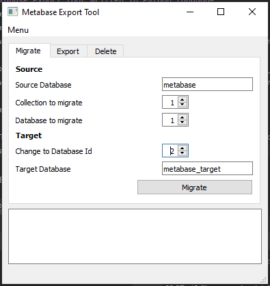

# Metabase Export Tool
#### Metabase database export tool written in Python language
This tool provides three main functionalities:
1. **Migrate**: export & import database (with related *metabase_table*, *metabase_field*, *metrics* tables) 
and Collection (with related *report_card*, *report_dashboard* and *report_dashboardcard* tables) 
from a DB source to a DB target
2. **Export**: export database (with related *metabase_table*, *metabase_field*, *metrics* tables) 
and Collection (with related *report_card*, *report_dashboard* and *report_dashboardcard* tables) 
from a DB source creating sql dump files (INSERT INTO statements)
3. **Delete**: delete a DB and a Collection (and their related tables)

Metabase Export Tool GUI was built using PyQt5 (Designer tool was used to write 
*MetabaseExportMain.ui* file)

Below a sample screenshot:



To setup program and download dependecies, run:
```shell script
python setup.py install
```

To start the program simply run:
```shell script
python metabaseExportTool.py
```
located in MetabaseExportTool folder.

